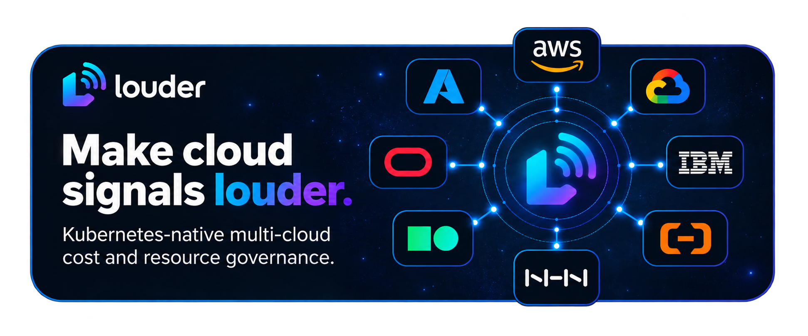

# Louder

SRE 멀티 클라우드 비용 플랫폼의 Go 보일러플레이트입니다. 현재 단계는 Operator와 Collector의 경계를 세우고, CRD 및 Provider 계약을 시작할 수 있도록 최소 구조를 둡니다.

## 구조

```text
cmd/operator/       Kubernetes Operator entry point
api/v1alpha1/       CloudAccount, BudgetPolicy, NotificationPolicy APIs
internal/controller/ Kubernetes reconciliation
internal/provider/  Provider-neutral collection contract
```

비용 수집 구현은 컨트롤러에 넣지 않습니다. Reconciler는 앞으로 Collector Job/CronJob의 생명주기를 관리하고, Provider 어댑터는 Collector 프로세스 안에서 실행합니다.

## 개발 명령

```bash
make build
make fmt
make vet
make test
make manifests
make docker-build
make kind-e2e
make kind-e2e-secrets
```

`make manifests`는 API 타입에서 CRD YAML을 생성합니다. 생성된 CRD와 이후 배포 매니페스트는 플랫폼 제약을 확인한 뒤 추가합니다.

`make docker-build`는 로컬 `louder-operator:local` 이미지를 빌드합니다. `make kind-e2e`는 Docker, kind, kubectl을 사용해 `config/kind/` 설정으로 임시 클러스터를 만들고 Operator를 배포한 뒤 CloudAccount reconcile 상태를 확인하고 클러스터를 삭제합니다. 이 smoke test는 CSP 호출이나 Vault/ESO 연동을 포함하지 않습니다.

`make kind-e2e-secrets`는 Docker, kind, kubectl, Helm, OpenSSL을 사용해 별도 임시 클러스터에서 Vault와 External Secrets Operator를 실행합니다. 스크립트가 가짜 billing credential과 단기 Vault token을 실행 중에 생성하고, ExternalSecret이 만든 Kubernetes Secret을 CloudAccount가 참조하는 상태까지 확인한 뒤 클러스터를 삭제합니다. 실제 CSP 계정이나 credential은 사용하지 않습니다.

초기 Provider 순서는 AWS, GCP, Azure입니다. 이후 CSP 어댑터는 공통 Provider 계약과 픽스처·계약·정규화 검증을 함께 추가합니다.
